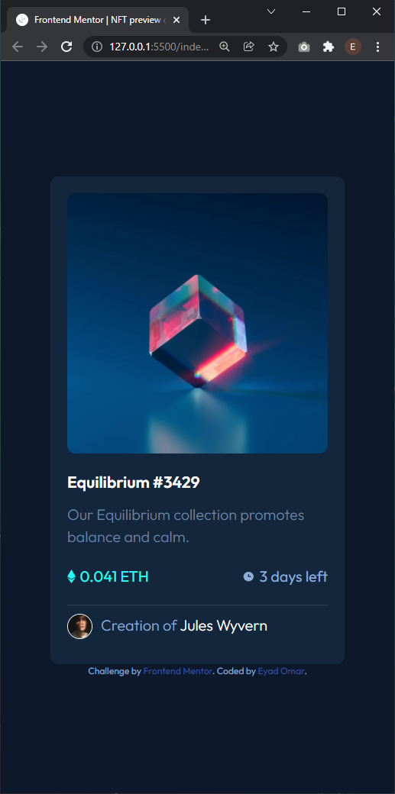

# Frontend Mentor - NFT preview card component solution

This is a solution to the [NFT preview card component challenge on Frontend Mentor](https://www.frontendmentor.io/challenges/nft-preview-card-component-SbdUL_w0U). Frontend Mentor challenges help you improve your coding skills by building realistic projects.

## Table of contents

- [Overview](#overview)
  - [Screenshot](#screenshot)
  - [Links](#links)
- [My process](#my-process)
  - [Built with](#built-with)
- [Author](#author)

**Note: Delete this note and update the table of contents based on what sections you keep.**

## Overview

Simple Card component I used flex-box to align itmes in card and the card itself in the page.

### Screenshots

## Process

### Links

- Solution URL: (https://www.frontendmentor.io/solutions/card-component-using-flexbox-MOBrqNaGA)
- Live Site URL: (https://eyadomar.github.io/Front-End-Mentor-NFT-Card-Component/)

### Built with

- Semantic HTML5 markup
- CSS custom properties
- Flexbox

## Author

- Website - [Eyad Omar](https://github.com/EyadOmar)
- Frontend Mentor - [@EyadOmar](https://www.frontendmentor.io/profile/EyadOmar)
